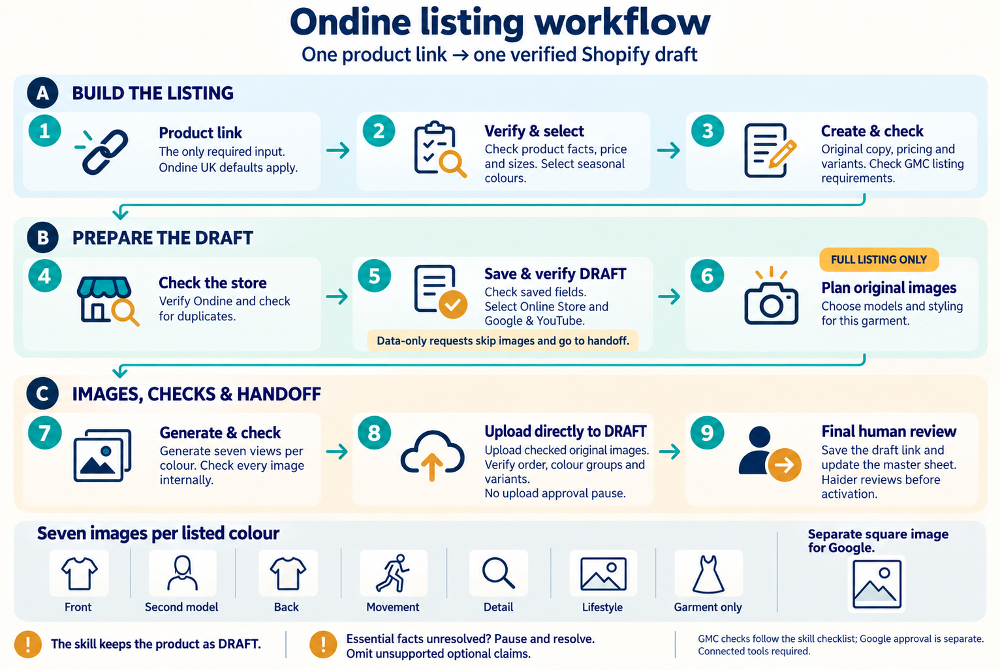

# Ondine operator readiness

Revised 2026-09-14 after Haider's first attempt. This document is part of the listing skill; it does not grant Shopify access or publication authority.

## Visual workflow

This overview follows the skill; full approval rules and operator readiness still apply.

## Start a listing

Read `SKILL.md` and its required references from the intact checkout. In ChatGPT Work, direct file reading is sufficient to apply the instructions to the task; a missing automatic skill registration is not by itself a blocker. Say “loaded for this task,” not “installed,” unless the client actually confirms installation. Do not assume a basic chat can read a repository, execute Python or use connected tools.

Provide the exact competitor product URL: this is the only required user input. Apply the Ondine UK profile and discover the source colours, then apply the profile’s seasonal selection rules. Colour preferences or a data-only request are optional overrides; ask only when a necessary decision cannot be resolved from the evidence and defaults. Verify product demand and seasonality before the research-sheet entry. Read the Ondine profile, copy template and checklist. Use one run folder for evidence, generated files, approvals and Shopify readbacks.

The assistant prepares one owned DRAFT, including Online Store and Google & YouTube selections. Haider checks product facts, sizing, price, all colour galleries, variants and the actual PDP before activating. Record the draft admin link and sheet status `Draft`; after human activation and verification use `Active`.

The September 13 operating decision permits operator self-review/publication subject to supervised tests and readiness. It does not establish that Haider has passed that readiness test. Until readiness and the applicable gallery-review delegation are recorded, retain the existing visual gates. Once Ilias explicitly delegates those gates for the operator workflow, record that scope and apply it without repeatedly asking Ilias. The assistant's Shopify writes remain DRAFT-only.

## Connect Google Sheets with the operator's own account

For the master-sheet workflow, Haider installs the
[Google Drive plugin](https://chatgpt.com/plugins/google-drive?open_in_app)
in his ChatGPT client and signs in with his own Google account. The plugin
includes Google Sheets tools. An equivalent connected Google Sheets integration
is also usable when it provides the required capabilities.
That account needs **Editor access** to the Ondine master sheet, and the
integration must expose both sheet-reading and cell-update tools. A connected
search-only app is not sufficient. Available integrations can differ by client;
check the tools actually available instead of assuming a particular app name
guarantees editing.

Find the exact Ondine master sheet through the connected account. If it cannot be
identified uniquely, ask Haider for its link once and retain it in his private
operator notes outside the release. Reuse that saved location on later runs.
The competitor product link remains the only per-product starting input after
the sheet and connections are configured.

No Google login, token or connection is supplied by this repository. Never ask
for Ilias's credentials or put credentials in GitHub. The host handles sign-in.
Use the operator's available Google connector; the local `gws` CLI is not a
package requirement. An expired connection in another session does not establish
that Haider's account is broken. A missing or read-only connection blocks the
sheet step, not an otherwise separately authorized URL-based draft.

## Match and update the master-sheet row

1. Read the sheet metadata, real tab names and column headings. Record the sheet,
   tab, source-link column, status column and existing draft-link column, if any,
   in private operator notes outside the release. Never assume column letters or
   a tab called Sheet1.
2. Match the competitor URL to exactly one product row, checking hyperlink
   targets when the visible cell is a product name. Preserve meaningful variant
   and market information in URLs. If the task is to choose the next product,
   use the sheet's recorded assignment/priority rules and check Shopify for an
   existing listing. Do not choose the old Aab test product by default. Missing
   or ambiguous rows require clarification; do not insert a duplicate row or
   infer a selection rule from row order alone.
3. Use the live competitor page for price and product facts. The sheet supplies
   the assignment; it is not the price source. Complete the requested scope and
   verify the Shopify draft first. For a complete listing, this includes the
   approved gallery and final read-back; for an explicitly data-only request,
   record that narrower completion in the handoff.
4. Re-read the matched row immediately before writing, since rows can move or
   another operator can update them. If it still matches and is eligible for
   this transition, update only its existing Status cell to **Draft** and its
   existing draft-link cell to the verified Shopify admin link. Preserve all
   other cells, formulas and formatting. Never downgrade an Active row. Do not
   add columns, change permissions or perform a dummy write to prove access.
5. Read back the changed cells. This first authorized real update proves write
   access; installing an integration or successfully reading a sheet does not.
   Report draft completion and sheet-update completion separately. If the sheet
   update fails, retain the draft link and pending row change so a retry does
   not create another Shopify product.
6. Only after Haider activates the product and Shopify confirms Active may the
   requested sheet handoff record **Active**. The assistant never activates the
   Shopify product as a side effect of updating the sheet.

## Complete distribution contents

- Entire `product-listing` directory: SKILL.md, profile, references, scripts, Python package, schemas and seven JSON shot templates under `profiles/ondine/higgsfield/`.
- The gallery handoff compiler and its dependencies from the separate Ondine Gallery app, or an installed equivalent validated against its contract. The referenced workspace path is not included merely by copying this skill folder.
- Python dependencies used by validators (including Pydantic) and framing analysis; compatible Node runtime for the gallery compiler. Determine actual installed versions during packaging rather than inventing requirements.
- Working source-reading tools, built-in image generation and the existing Ondine Shopify connector available in Haider's client. Firecrawl is optional when the existing browser or bundled public-source helper provides the required evidence. Never include Ilias's credentials or vault-wide private context.
- Keep run evidence, local settings history and operator feedback outside the replaceable release directory; do not overwrite them during updates.

## First trial and actual readiness

The outdated document checksum mismatch is repaired through a separately pinned maintenance record, authorized by Ilias in this conversation. Original signed locks and historical fixtures remain unchanged; the maintenance record does not claim independent reviewer approval. Current production media checks require seven ordered images and the current review gate. The original exact example remains a historical, noncommittable fixture.

The runtime accepts a product-specific run registry using `register_projection.py` and the validator's `--product-registry` plus external SHA-256 pin. Follow [product evidence registration](product-evidence-registration.md). Historical locks and examples stay unchanged. Genuine separate review of source facts remains required; registration is not an approval generator. Never use test mode or manufacture reviewer attestations.

Haider reports using ChatGPT Work with repository access, passing offline tests, built-in image generation and a connected Ondine Shopify tool. These are operator-reported capabilities, not proof of a completed listing. Verify them in his actual session as the task runs. A first supervised real-product trial is how readiness is tested; it is not necessary to have passed a previous trial to begin it.

For that trial: load the instructions; read the exact product and UK evidence with the available tools; prepare and independently review the product facts; validate the proposed listing; verify the store and duplicate checks; create or resume the one authorized DRAFT and read it back. Continue images only through the existing approval gates. Report the actual draft link and read-back result, or the exact unresolved blocker. Do not finish with a generic “setup not ready” message when the next supported step can be performed.

If the client cannot access the source through any supported reading tool, cannot run required scripts, cannot obtain independent fact review, or cannot use the existing Shopify connector, stop at that concrete boundary. Do not create a replacement connector. Local testing cannot establish Haider's access, and a passing offline test suite is not proof of a live listing.

## Updates

The maintainer pushes an approved update to the shared GitHub repository and tells Haider. Haider asks his assistant to run `git pull --ff-only` before the next product, then reload the instructions and run the checks. Keep one revision throughout a product run. Preserve the previous working revision and local feedback; stop on conflicts rather than discarding local work. There is no automatic updater. Do not change repository visibility as part of updates.

## Verification boundaries

The earlier maintenance repaired outdated checksums and gallery rules. The September 14 repair addresses source-tool portability, direct instruction loading and product registration. Record fresh check results in the release notes. Report source capture, offline validation, connector read, DRAFT creation and complete gallery as separate observed milestones. Never infer one from another.
